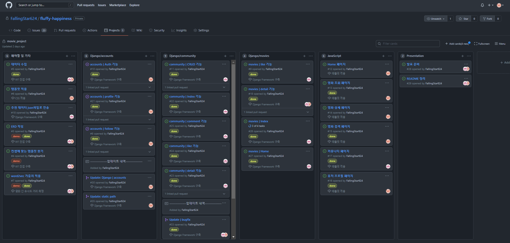

# fluffy-happiness

### 1. 프로젝트 개요

- 프로젝트 이름: fluffy-happiness

- 프로젝트 주제: 추천 알고리즘을 적용한 영화 커뮤니티 사이트

- 기술 스택:       

- 기간: 11.17 ~ 11.25 (목, 18:00까지)

- 발표: 11.26 (금, 종강식날)

- 팀원: 🤛`김경수`, `최광호`🤜

- 진행 by `github`

  github을 통해 issue 및 타임라인 관리

  wiki를 활용하여 그날 그날의 이슈들을 정리

  

### 2. 프로젝트 컨셉

- 컨셉

  - 검은색과/노란색/흰색을 사용하여 영화관의 느낌으로 전체적으로 영화관에 있는 듯한 느낌을 사용자에게 제공
  - 영화를 위한 공간과 영화 리뷰를 위한 공간을 분리하여 각각 `Movie`와 `Review`로 구현

  - 페이지 구성

     |                   |                           |                             |
    | ------------------------------------------------------------ | ------------------------------------------------------------ | ------------------------------------------------------------ |
    | `Anonymous Home `                                            | `Signup`                                                     | `Login`                                                      |
    |             |  |             |
    | `Review Create`                                              | `Review Create Autocomplete`                                 | `Review Detail`                                              |
    |                 |  |           |
    | `Movie Index`                                                | `Movie Index Autocomplete`                                   | `Movie Detail Trailer`                                       |
    |           |                   |  |
    | `Movie Detail Recommend`                                     | `User Home`                                                  | `Review Authority Verification`                              |
    |  |   |               |
    | `Like and Comment`                                           | `User Profile`                                               | `Review Index`                                               |
    |             |  |                             |
    | `Review Search`                                              | `Movie Comment Verification`                                 | `About`                                                      |


### 3. ERD


###  4. 주요기능

- #### 홈 화면 추천 기능

  

  :framed_picture: 6개의 추천 영화들이 나오고 있는 홈 화면

  - 사용자가 특정 영화를 보았다고 표시하면 DB에 표시 시각을 저장
  - M:N관계를 이용하여 사용자가 본 영화들을 모두 조회하고 그 중 가장 최근에 본 영화를 검색
  - 해당 영화가 가지고 있는 `recommend`필드에 저장된 추천 영화들을 홈 화면에서 출력


- #### 프로필 장르 태그

  

  :framed_picture: test1 유저의 장르 태그(`#액션` `#드라마` `#범죄`)

  - 사용자가 본 영화들을 `views.py`에서 조회한 다음 장르별로 개수를 카운트하고 가장 많이 시청한 3개의 장르를 선택하여 프로필 페이지에서 출력

  - 작성 코드

    ```python
    most_genres = {} # 영화별 장르 카운트를 저장할 dict
    for movie in host_movies: # 사용자가 본 영화들을 순회
        tmp_genres = movie.movie.genres.all() # 선택한 영화가 가진 모든 장르를 tmp_genres에 저장
        for genre in tmp_genres:
            if not most_genres.get(genre.name, 0): # tmp_genres를 순회하면서 장르들을 카운트
                most_genres[genre.name] = 1
            else:
                most_genres[genre.name] += 1
                
    most_genres = heapq.nlargest(3, most_genres, key=most_genres.get) # heapq 라이브러리를 사용하여 가장 많은 장르 3개만 저장
    ```


- #### 검색어 자동완성

​	:framed_picture: 리뷰 생성 페이지

- 자동완성 기능에서 더 나아가 검색한 영화를 클릭하면 해당 영화의 포스터가 왼쪽에 출력되도록 구현

- 코드 예시

  ```javascript
  <script>
      // 5. 화면에 비동기식으로 포스터 출력
      function selected_poster(path) {
          const poster = document.querySelector('#selected-poster')
          poster.style = `background-image: url("http://image.tmdb.org/t/p/original${path}"); background-size: contain;`
      }
  
  	// 1. 자동완성 기능 호출	
      new Autocomplete('#autocomplete', {
          		// 2. input = 사용자가 입력한 단어
            search : input => {
                
                ...
                // 3. 매 입력단위마다 요청을 보냄
              return new Promise(resolve => {
                if (input.length < 2) {
                  return resolve([])
                }
                fetch(url)
                .then(response => response.json())
                .then(response => {
                  resolve(response.data)
                })
              })
            },
           
  			...
            // 4. 사용자가 선택한 결과를 selected_poster 함수로 보냄
            onSubmit : result => {
              fn_selTest(result.title)
              selected_poster(result.poster_path)
            }
          })
  </script>
  ```

  

