# fluffy-happiness

### 1. 프로젝트 개요

- 주제: 추천 알고리즘을 적용한 영화 커뮤니티 사이트
- 기술 스택:       
- 기간: 11.17 ~ 11.25 (목, 18:00까지)
- 발표: 11.26 (금, 종강식날)

### 2. 프로젝트 컨셉 및 주요 기능

- 컨셉

- 주요 기능

  - 추천 알고리즘

  

  - 페이지 구성

     | 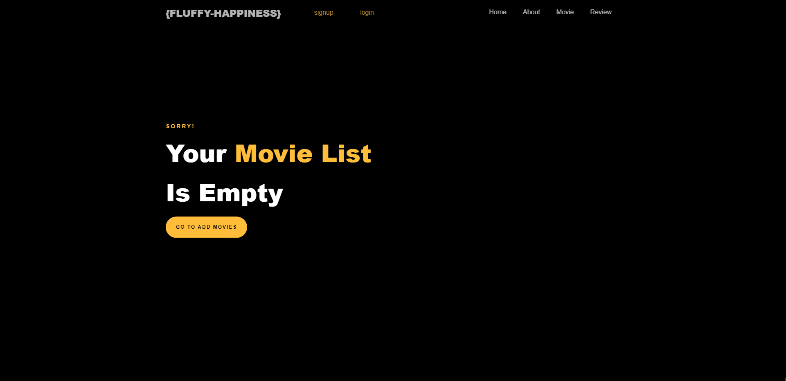                  | 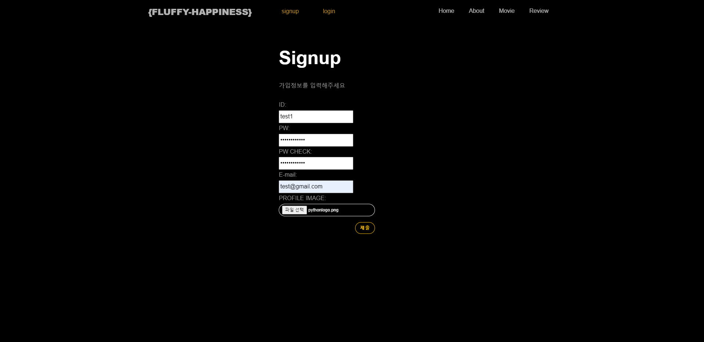                          | 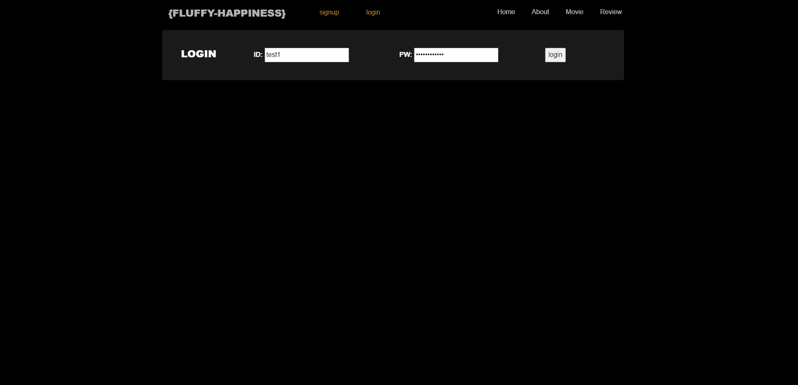                            |
    | ------------------------------------------------------------ | ------------------------------------------------------------ | ------------------------------------------------------------ |
    | `Anonymous Home `                                            | `Signup`                                                     | `Login`                                                      |
    | 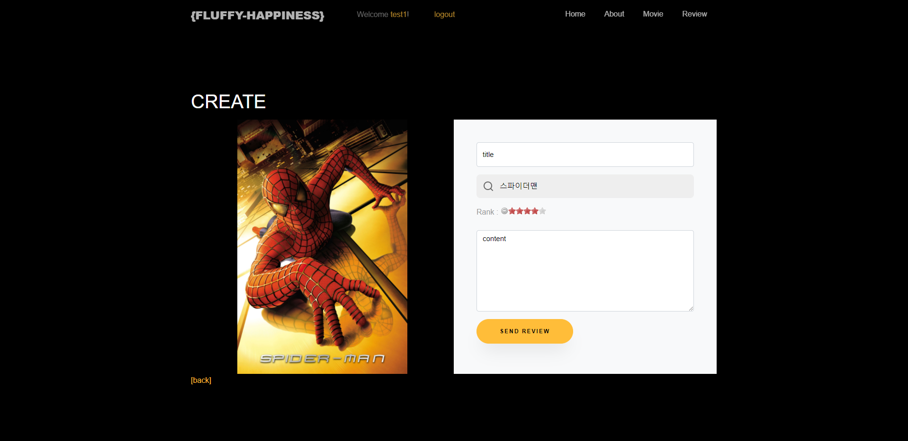            | 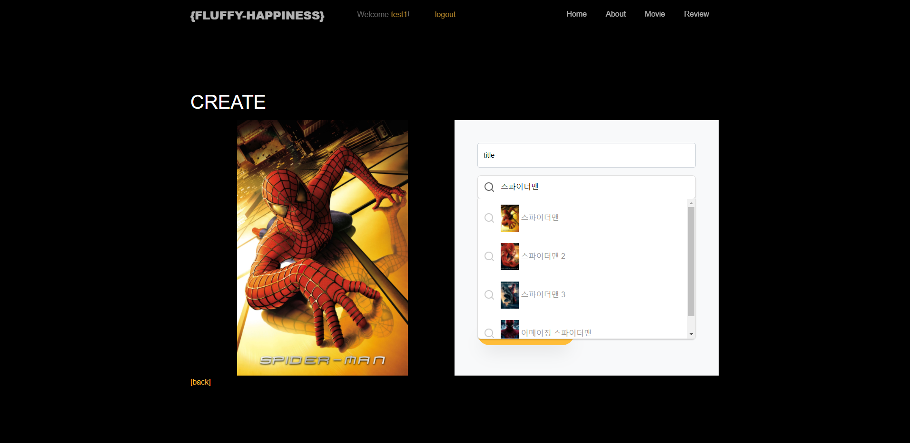 | 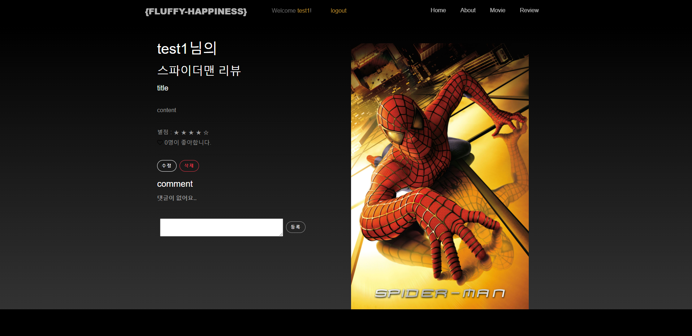            |
    | `Review Create`                                              | `Review Create Autocomplete`                                 | `Review Detail`                                              |
    | 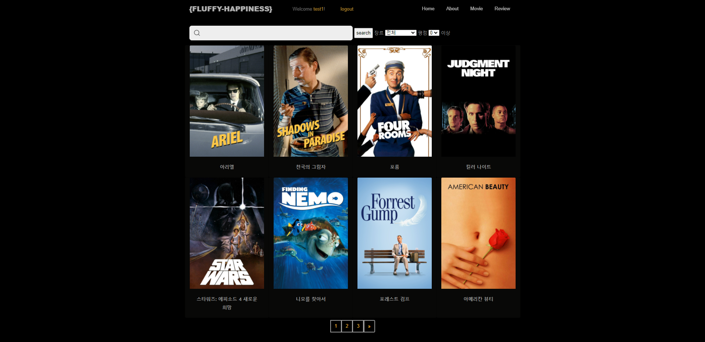                | 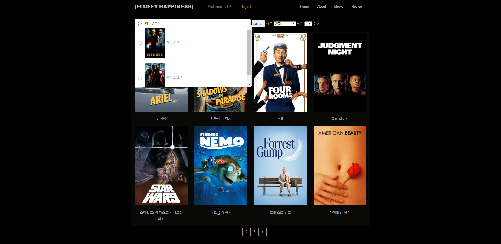 | 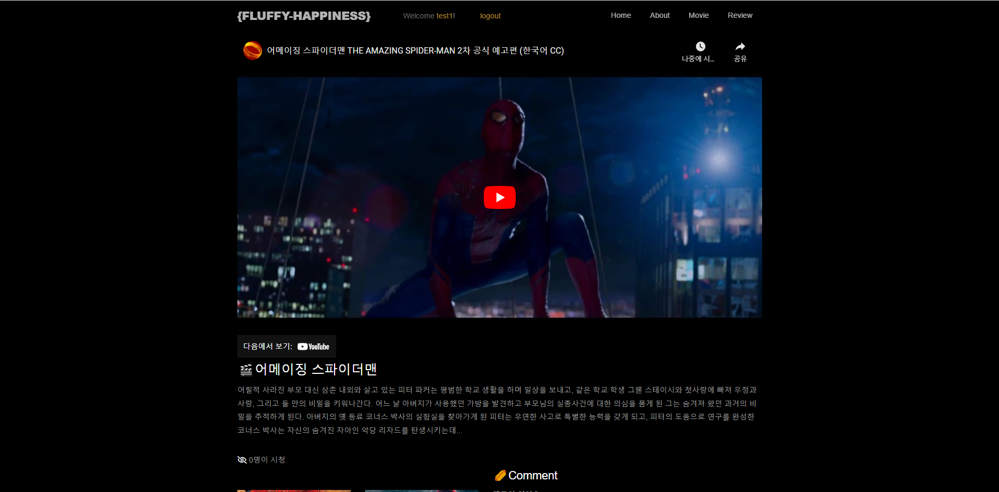          |
    | `Movie Index`                                                | `Movie Index Autocomplete`                                   | `Movie Detail Trailer`                                       |
    | 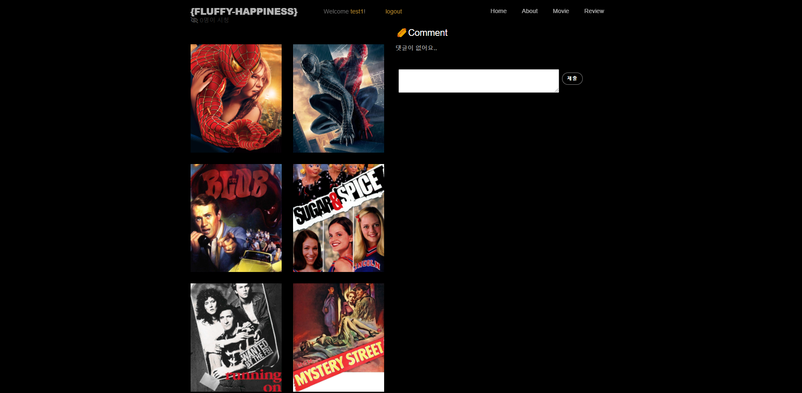          | 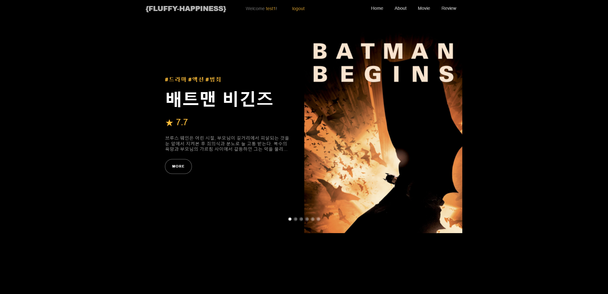                  | 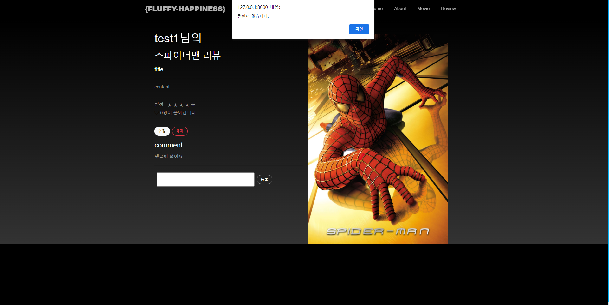 |
    | `Movie Detail Recommend`                                     | `User Home`                                                  | `Review Authority Verification`                              |
    | 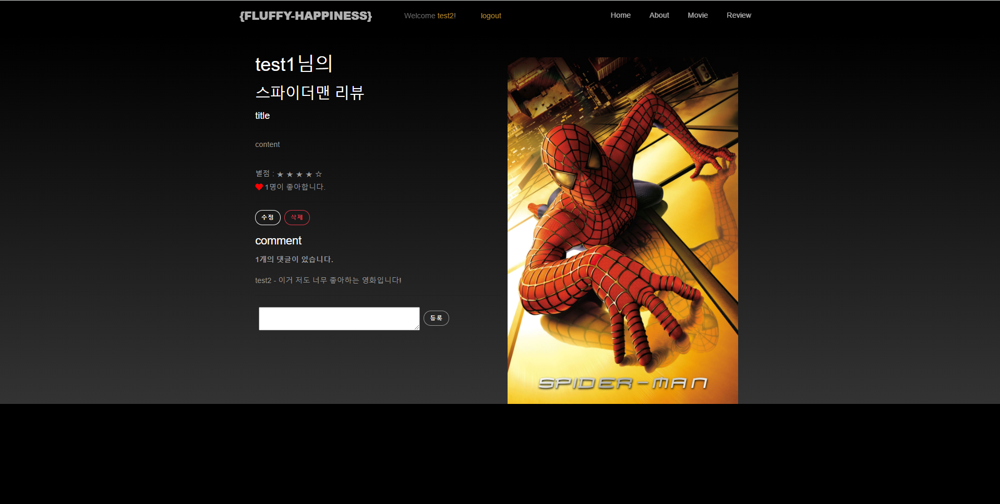 | 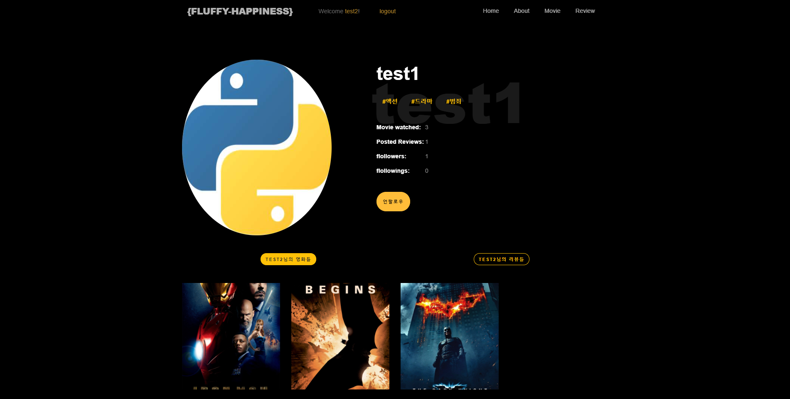  | 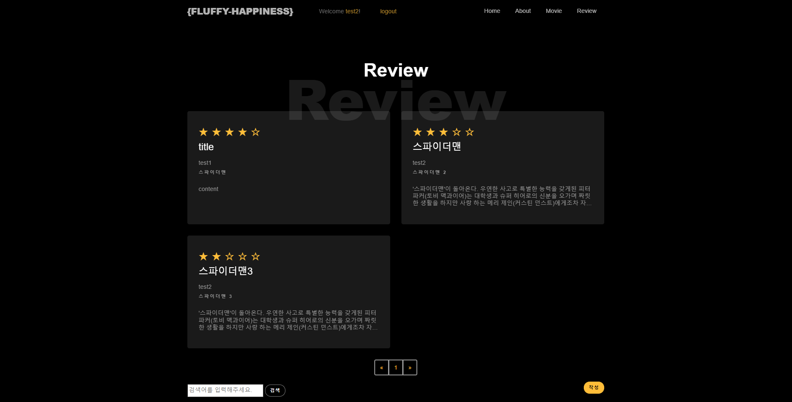              |
    | `Like and Comment`                                           | `User Profile`                                               | `Review Index`                                               |
    | 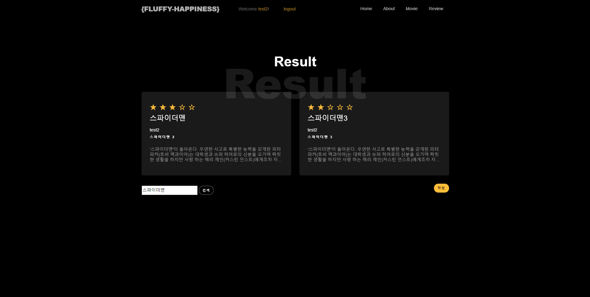            | 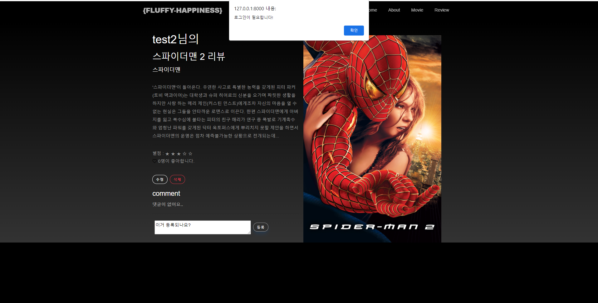 | 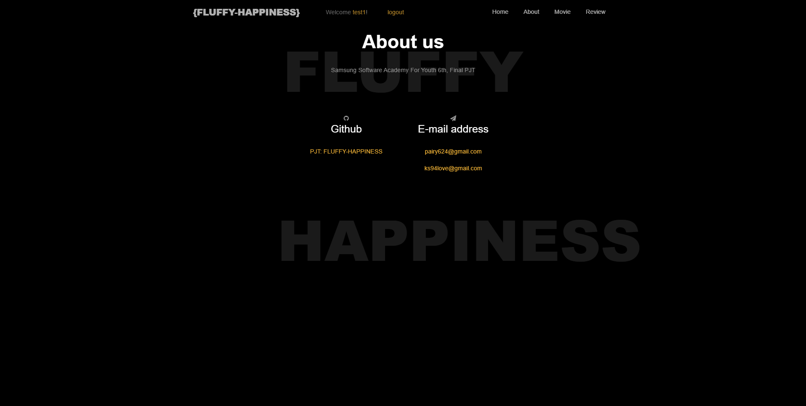                            |
    | `Review Search`                                              | `Movie Comment Verification`                                 | `About`                                                      |

    

### 3. ERD

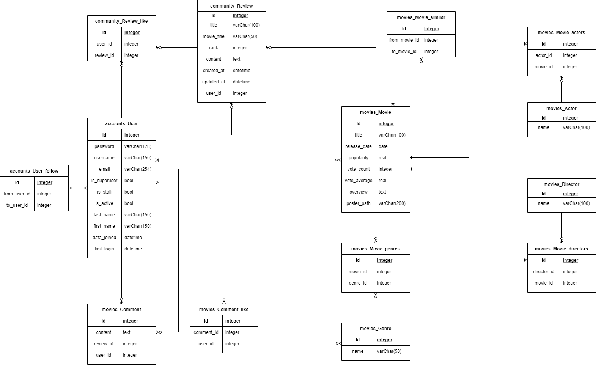

###  4. Wireframe

